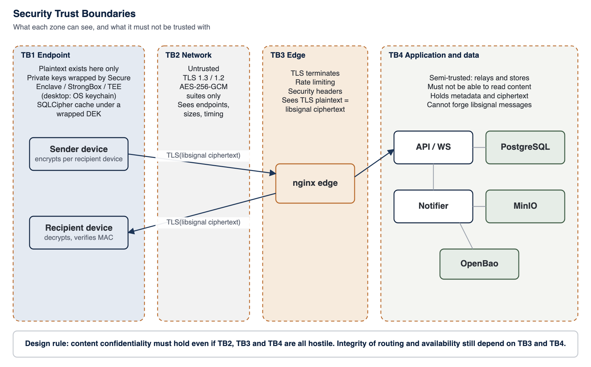

<!-- SANKET Technical Security & Architecture Whitepaper, public edition, version 2.0. Generated from docs/whitepaper; do not edit by hand. -->

# 5. Threat Model

A security architecture is only as meaningful as the threats it is evaluated against. This chapter states the assets SANKET protects, the trust assumptions it makes, and the threat actors it is designed to resist, with the residual risk that remains for each.

## 5.1 Assets

*Table 7: Protected assets*

| Asset | Description | Primary property |
| --- | --- | --- |
| **Message content** | Text and structured content of direct and group messages, reactions, encrypted broadcasts and classification labels | Confidentiality, integrity |
| **File content** | Documents, images, audio and video exchanged as attachments | Confidentiality, integrity |
| **Call media** | Voice and video frames | Confidentiality |
| **End-user keys** | libsignal identity, prekeys and session state; file and call keys; the account list key that signs the device list; device client-certificate keys | Confidentiality, integrity |
| **Credentials** | Passwords, TOTP secrets, session and refresh tokens, passcodes | Confidentiality |
| **Communication metadata** | Who communicates with whom, when, how often, from which device and network | Confidentiality |
| **Organisation data** | User directory, group membership, roles, policy | Confidentiality, integrity |
| **Audit trail** | Record of security and administrative events | Integrity, availability |
| **Service availability** | The ability to communicate when needed | Availability |
| **Server secrets** | Token signing secrets, field keys, OpenBao keys, TLS private keys | Confidentiality |
| **Software integrity** | The code that runs on servers and endpoints | Integrity |

## 5.2 Trust Assumptions

- **Endpoints running genuine SANKET code are trusted to protect plaintext while in use.** A fully compromised endpoint is out of scope for content confidentiality (Chapter 29).
- **The server is not trusted with content.** SANKET is designed so that a hostile server learns no message, file, call, reaction, encrypted-broadcast or classification-label content, cannot forge messages and cannot silently add a device to an account. The server is trusted for availability, routing and enforcement of access policy, and it sees metadata (Chapter 20).
- **The network is untrusted.** All client traffic is TLS-protected and content is additionally end-to-end encrypted.
- **Cryptographic primitives behave as specified.** SANKET relies on libsignal, AES-256-GCM, X25519, Ed25519, HKDF, SHA-256, Argon2id and ML-KEM as published and analysed.
- **The customer operates the infrastructure competently.** Host hardening, physical security, backups, firewalling and key custody are customer responsibilities in a self-hosted deployment, supported by the baseline in Chapter 42.
- **Random number generation on endpoints and servers is sound.** Keys are drawn from operating-system cryptographic random number generators.

## 5.3 Methodology

Threats are organised by actor and mapped to the STRIDE categories of Spoofing, Tampering, Repudiation, Information disclosure, Denial of service and Elevation of privilege.[^1] MITRE ATT&CK provides a common vocabulary for the adversary techniques involved, and is referenced where it adds precision.[^2] For each actor the matrix records the objective, the attack surface, the principal controls and the residual exposure.

*Figure 1: Security trust boundaries*

The figure above summarises the four trust boundaries. The design rule is that content confidentiality must survive the loss of every boundary except the endpoint. Integrity of routing, enforcement of policy and availability do depend on the edge and the server, which is why those components are hardened and audited even though they never see content.

## 5.4 Threat-Control Matrix

*Table 8: Threat-control matrix*

| Threat actor | Objective | Attack surface | Principal controls | Residual exposure | STRIDE |
| --- | --- | --- | --- | --- | --- |
| **Passive network eavesdropper** | Read content; map who talks to whom | Internet, Wi-Fi, mobile carrier, any link between device and edge | TLS with AES-256-GCM suites only; libsignal end-to-end encryption inside TLS; HSTS | Traffic analysis: timing, volume and the fact that a device talks to the installation | I |
| **Active man-in-the-middle** | Intercept or alter traffic; impersonate the server | TLS handshake, DNS, captive portals, rogue access points | Certificate validation against the customer CA; certificate pinning on desktop and mobile; end-to-end encryption means a TLS break exposes only ciphertext and metadata | Content stays end-to-end encrypted even if transport security is subverted | S, T, I |
| **Compromised network device** | Capture, redirect or drop traffic | Routers, firewalls, proxies inside customer or carrier networks | As above; end-to-end encryption; integrity of every libsignal message (MAC) | Denial of service; metadata | T, I, D |
| **Malicious internet intermediary** | Same as above at internet scale | Transit providers, DNS resolvers | Air-gapped or private-network deployment removes the path; TLS; E2EE | Availability and metadata for connected deployments | T, I, D |
| **External attacker (remote)** | Gain access to the service or its data | HTTPS edge, media port, exposed APIs | One public TCP 443 (HTTPS and TURN, routed by server name without decryption) plus the media UDP port; strict input validation; authentication on every API; device mutual TLS; edge and application rate limits; security headers | Undiscovered vulnerabilities in exposed code | S, T, E |
| **Credential thief** | Sign in as a user | Password phishing, reuse, keylogging | Second factor always required: FIDO2 security keys (WebAuthn) for administrators, bound to the customer's admin origin; TOTP for end users; per-account and per-IP rate limits; lockout; new devices subject to caps and optional admin approval | Bounded by the strength of the second factor; administrators use phishing-resistant security keys | S |
| **Session token thief** | Use stolen access or refresh tokens from another machine | Tokens copied from a device, a log or an intercepted session | Device mutual TLS: a client certificate whose key is generated on the device (hardware-backed store on phones) and never leaves it, verified by the edge and bound to the device record; single-use refresh tokens with reuse detection; short token lifetimes; device binding | Bounded by short token lifetimes, single-use refresh and device binding | S, E |
| **Stolen endpoint attacker** | Read messages and keys on a seized device | Physical device | OS full-disk encryption; app passcode and biometric lock; SQLCipher cache; protocol state and device secrets encrypted under a hardware key (Secure Enclave on iOS, StrongBox or the TEE on Android); wipe after failed attempts; lost mode; remote wipe | Forensic attacks on an unlocked or compromised OS | I |
| **Malicious insider (end user)** | Exfiltrate content they can legitimately read | Their own authorised device | Download and export policy; screenshot blocking and detection; forwarding controls; audit of file events | An authorised reader can always photograph or retype content | I, R |
| **Privileged administrator** | Read content; impersonate users; cover tracks | Admin console, database, hosts | No content keys on the server; RBAC with least privilege; mandatory administrator second factor; federated sign-in only from the customer's own identity provider and only as a first factor; senders verify signed device lists, so an administrator cannot silently add a device to a user's account; hash-chained audit log; separation of duties by role | Access to server-visible metadata (Chapter 20); mitigated by separation of duties | I, T, R, E |
| **Compromised application server** | Read or alter messages; add a device; impersonate | API and WebSocket processes | libsignal E2EE: no plaintext or private keys on the server; message MACs; reactions, encrypted broadcasts and classification labels travel inside the end-to-end encrypted envelope; broadcast priority, deadline, sent time and expiry are also inside it, so the server cannot downgrade or replay a broadcast; senders verify each account's signed, append-only device list before encrypting, so a device the server adds receives no copy; identity keys pinned on first contact | Server-visible metadata (Chapter 20); withholding or delaying messages; denial of service | S, T, I, D |
| **Compromised database server** | Bulk theft of stored data | PostgreSQL storage and backups | Ciphertext only for message bodies, files, reactions and encrypted broadcasts (broadcast copies deleted per device once stored); Argon2id password hashes; encrypted secret fields | Server-visible metadata only (Chapter 20) | I |
| **Compromised storage system** | Read stored files | MinIO object store and its disks | Files encrypted on the device with per-file AES-256-GCM keys; objects are opaque | Opaque ciphertext only; availability | I, D |
| **Rogue device** | Join an account or conversation | Device registration, device linking | Device caps without silent eviction; optional admin approval; desktop linking only from a trusted phone with TOTP step-up and libsignal signature; every device addition signed into the account's device list by an approving device, and senders encrypt only for devices on that signed list; device inventory | Social engineering of an approver, countered by device inventories, notifications and audit | S, E |
| **Replay attacker** | Re-submit captured traffic | API requests, messages, tokens, webhooks | TLS replay protection; libsignal per-message keys and duplicate rejection; single-use refresh tokens and TOTP challenge tokens; idempotency keys; webhook timestamps | Minimal | S, T |
| **Supply-chain attacker** | Insert malicious code into a release | Dependencies, build system, release artefacts, update channel | Frozen lockfile builds; pinned upstream sources; Ed25519-signed release manifest with per-image SHA-256; per-image SBOM verified on offline and connected upgrades; offline verification; customer-controlled installation; pre-commit cryptographic policy checks | Compromise upstream of the build | T, E |
| **Metadata analyst** | Infer organisation structure and activity | Server database, network observation | Self-hosting keeps metadata inside the customer boundary; retention windows; masking of identifiers in edge logs; content-free push payloads | Inside the boundary, metadata is visible to operators (Chapter 20) | I |
| **Brute-force attacker** | Guess passwords, codes or passcodes | Login, TOTP, activation codes, device passcode, vault password | Argon2id; per-account and per-IP limits; lockout; TOTP failure caps; passcode PBKDF2 with 600,000 iterations and wipe after N failures; vault PBKDF2 600,000 iterations | Bounded by password strength | S |
| **Malicious software update** | Run attacker code in the installation | Upgrade process | Customer decides when to upgrade; signed manifest and hash verification; staging; encrypted restore point and automatic rollback on any failed step | A signed release that is faulty rather than malicious; mitigated by staging | T, E |
| **Freeze or rollback attacker** | Hold an installation on an old release, or roll it back to a vulnerable one | Update channel, offline media, vendor registry responses | Signed manifest carries a monotonic sequence number and an expiry; install and upgrade refuse an expired manifest or one below the recorded sequence floor, and two releases claiming one sequence with different content; connected upgrades also require a short-lived signed timestamp statement under a separate key, refused if missing, expired, naming another manifest or older than the newest seen | An air-gapped installation learns of newer releases only through its own media | T, D |
| **Lateral-movement attacker** | Move from one compromised service to others | Container network, shared hosts | Only the edge published; OpenBao on an internal-only network; least-privilege service credentials; container hardening | Host-level compromise is equivalent to installation compromise (Chapter 42) | E |
| **Denial-of-service attacker** | Make the service unavailable | Edge, media ports, expensive APIs | Layered edge and application rate limiting with adaptive protection and per-feature limits | Volumetric attacks beyond the customer's network capacity; the multi-host high-availability profile removes single points of failure | D |
| **Restrictive network** | Prevent calls by allowing only outbound TCP 443 | Hotel, ministry, carrier or enterprise firewalls | TURN over TLS on the same public TCP 443 as HTTPS, terminated by the edge with TLS 1.3 and an AES-256-GCM suite only; relay limited to the node's own media address; media stays SRTP AES-256-GCM with end-to-end encrypted frames; UDP media remains the primary path where allowed | Higher latency over TCP; a network that blocks or intercepts TLS to the installation still denies service | D |
| **Harvest-now, decrypt-later adversary** | Record traffic today to decrypt it with a future quantum computer | Any recorded link between device and edge | Message content: libsignal with post-quantum key agreement (PQXDH) and ratchet (SPQR); transport: the edge offers hybrid X25519MLKEM768 key exchange first, negotiated wherever the client platform's TLS stack supports it; the server's outbound TLS offers it too | Message content is post-quantum protected by libsignal independently of transport; hybrid signatures for releases and licences are on the roadmap | I |
| **Physical server theft** | Take servers and their data | Data centre, edge sites | End-to-end encryption; OpenBao sealed at rest; recommended full-disk encryption with TPM | Depends on customer full-disk encryption (Chapter 42) | I |
| **Backup theft** | Recover data from backup media | Backup archives and media | Every component encrypted with its own AES-256-GCM key; database and object keys wrapped by the installation's OpenBao, the recovery key under a scrypt passphrase-derived key; Ed25519-signed manifest verified before restore; content already end-to-end encrypted | Bounded by passphrase strength and custody | I |
| **Endpoint malware** | Read content as it is displayed or typed | Compromised phone or computer | Encrypted local storage; screenshot blocking where configured; managed devices; remote wipe; minimal local plaintext | High: E2EE does not protect a compromised authorised endpoint (Chapter 29) | I, T, E |

## 5.5 Threat Model Conclusions

Three conclusions follow from the matrix and shape the rest of the architecture.

1. **Content confidentiality is robust against network and server compromise.** Every network and server-side actor in the matrix obtains at most ciphertext of message bodies, files, reactions, encrypted broadcasts and classification labels, because the keys exist only on endpoints, and senders encrypt only for devices on each account's signed device list. This is the core property that end-to-end encryption delivers.
2. **Metadata and availability are where server-side actors retain power.** A compromised server, database or privileged administrator can learn communication patterns and can deny service. Self-hosting confines that exposure to the customer's own staff and infrastructure, rather than eliminating it.
3. **Endpoints and insiders remain the hardest problem.** No cryptographic design protects plaintext from a fully compromised authorised device or from an authorised reader. SANKET reduces the exposure with local encryption, device governance and policy, and is explicit that the residual risk is significant.

---

[^1]: A. Shostack, "Threat Modeling: Designing for Security", Wiley, 2014 (STRIDE methodology).
[^2]: The MITRE Corporation, "MITRE ATT&CK Enterprise and Mobile Matrices", attack.mitre.org.

---

[Previous: 4. Sovereignty as a Security Control](04-sovereignty-as-a-security-control.md) | [Contents](../README.md) | [Next: 6. Security Architecture Principles](06-security-architecture-principles.md)
