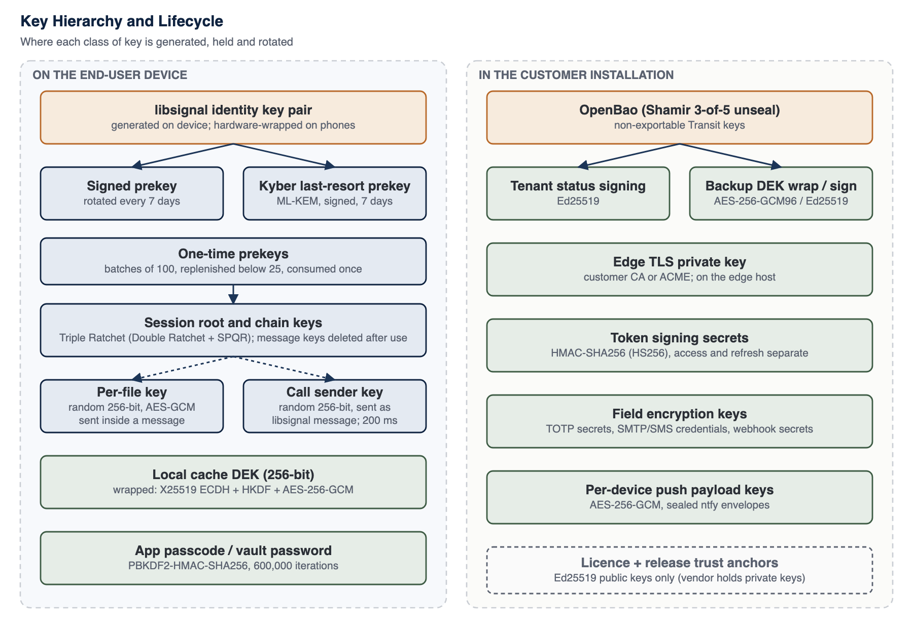

<!-- SANKET Technical Security & Architecture Whitepaper, public edition, version 2.0. Generated from docs/whitepaper; do not edit by hand. -->

# 11. Key Management Architecture

Every key in SANKET has a defined origin, location, purpose and lifetime. The organising principle is simple: keys that protect content are created and held on endpoints; keys that protect the installation are created and held inside the customer's installation; Tosh Defence holds only the keys that sign licences and releases.

Key lifecycle management follows the general model of NIST SP 800-57: generation, distribution, storage, use, rotation, revocation and destruction are defined for every key class.[^31]

*Figure 4: Key hierarchy and lifecycle*

## 11.1 Key Generation and Entropy

All keys are generated from operating-system cryptographically secure random number generators: libsignal draws from the platform CSPRNG; the mobile JavaScript environment installs the platform CSPRNG as its random source before any cryptographic library loads; Node.js keys use its OpenSSL-backed generator; OpenBao generates its own Transit keys. No key is derived from a password except where a password is the intended protection (vault, app passcode, backup passphrase), and in those cases a deliberately slow key derivation function is used.[^32]

## 11.2 Hardware-Backed Storage

On iOS, the libsignal store and device secrets are kept in the Keychain with accessibility classes that restrict them to this device, so they are excluded from device backups and transfers, and every value is additionally encrypted with AES-256-GCM under a key derived from a **Secure Enclave** P-256 key (ECDH, then HKDF-SHA256 to a 256-bit key).[^33] On Android, the same values are encrypted with AES-256-GCM in the module's own store under a key held in **StrongBox** where the phone has one, and in the TEE-backed Android Keystore otherwise; Android application backup is disabled for the app.[^34] The libsignal identity key stays in libsignal's own format, because the Secure Enclave cannot hold a Curve25519 key, but it is stored only under the hardware wrapping key; the device certificate key and the account list key receive the same protection. Items copied from one phone to another do not decrypt.

Each phone records its protection level (Secure Enclave on iOS; StrongBox or TEE on Android; software only on simulators and emulators), the server holds it per device and the administrator console shows it, and policy can require a minimum level. On Android the level is backed by Key Attestation, verified offline by the installation (Chapter 14). Deleting the hardware key makes every wrapped item unreadable at once, which is the fast path of a wipe.

Attachment files and decrypted viewer copies on iOS carry the Complete data-protection class, whose file keys the operating system discards when the device locks. On desktop the same protocol runs with its secrets in the operating system's protected credential store, and an app passcode adds a second, passcode-derived wrap held only in memory; deployment guidance for desktop key storage on each operating system is given in the controlled edition.

## 11.3 Key Inventory

*Table 19: Key inventory: origin, storage, purpose, rotation and exposure consequence*

| Key type | Generated where | Stored where | Purpose | Rotation | Exposure consequence |
| --- | --- | --- | --- | --- | --- |
| **libsignal identity key pair** | End-user device (libsignal) | Phone secure store (this device only), encrypted under the hardware wrapping key below; desktop: the operating system's protected credential store. Optionally in the encrypted vault backup | Device authentication in PQXDH; signs prekeys and device-link approvals | Account-wide rotation with proof of the previous key and TOTP step-up; peers are notified and re-establish sessions | Impersonation of that device to new sessions; does not decrypt past messages (forward secrecy) |
| **Account list key pair (Curve25519, libsignal)** | Primary device of the account (libsignal) | Primary device secure store under the hardware wrapping key; sealed in the encrypted vault backup | Signs the account's device list; every new device and desktop link adds a signed entry | Long-term; replaced only by vault restore with the restore proof or by an audited recovery procedure that warns every peer | Ability to add a device to the account's signed list (still subject to device approval, caps and the user-visible inventory); no message decryption |
| **Hardware wrapping key** | Phone secure hardware: Secure Enclave P-256 key (iOS); StrongBox key, or TEE key where StrongBox is absent (Android) | Inside the secure hardware, never exportable | Wraps the libsignal store, device secrets, the device certificate key and the account list key with AES-256-GCM (iOS: ECDH plus HKDF-SHA256 to a 256-bit key) | Per app installation; deleting it is the fast wipe | Requires running code on the unlocked device; the wrapped stores cannot be decrypted on another device |
| **Device client certificate key (ECDSA P-256)** | Device; certificate signing request built on the device | Phone: hardware-backed store; desktop: Electron main process (the renderer never sees it) | Mutual TLS to the edge on REST, WebSocket and media signalling | Certificate short-lived and re-minted before expiry; deleted on revoke, lost mode and wipe | Presenting that device's certificate; still needs the device's tokens, which are bound to the same device record |
| **Signed prekey** | Device | Device secure store; public half on server | Medium-term DH key for session start | Regularly | Affects only sessions started with it that also lack a one-time prekey; past messages protected by ratchet |
| **Kyber prekeys (Kyber-1024): one-time keys and a last-resort key** | Device | Device secure store; public halves on server, one-time keys until handed out | Post-quantum contribution to session start | One-time keys: consumed once and replenished automatically; last-resort key: rotated regularly | One-time key: a single session start. Last-resort key: post-quantum protection of handshakes made with it while no one-time key remained. Classical protection remains in both cases |
| **One-time prekeys** | Device | Device secure store; public halves on server until handed out | Single-use DH contribution to session start | Consumed once; replenished automatically | Minimal: a single session start |
| **Root, chain and message keys** | Device (Double Ratchet) | libsignal session store on device; message keys deleted after use | Per-message encryption and authentication | Every message (symmetric ratchet); every round trip (DH ratchet) | Exposes messages until the next DH ratchet step not observed by the attacker |
| **Per-file key (256-bit)** | Sending device (CSPRNG) | Inside the libsignal-encrypted message (Chapter 18) | AES-256-GCM encryption of one attachment | Never reused: one per file | One file |
| **Call sender key (256-bit)** | Each participant device | Memory only; delivered to peers as libsignal messages; never stored by server | AES-256-GCM frame encryption of that sender's media | HKDF ratchet every 200 ms; new random key on every join and leave | That sender's media for the current key epoch |
| **Local cache DEK (256-bit)** | Device (CSPRNG) | Wrapped by X25519 ECDH + HKDF + AES-256-GCM envelope; plaintext only in memory while signed in | SQLCipher database key and AES-256-GCM file cache key | Per user per device; destroyed on wipe | Local history on that device |
| **Device X25519 key (cache envelope)** | Device | Platform secure storage, this device only (under the hardware wrapping key on phones) | Unwraps the cache DEK | Deleted on sign-out and wipe | Local cache on that device |
| **App passcode verifier and duress keys** | Device | Secure storage; PBKDF2-HMAC-SHA256 600,000 iterations | Local unlock; duress detection | User-changed | Local unlock bypass (still bounded by OS protections) |
| **Vault keys (optional)** | Device, from vault password and recovery code | Encrypted blob on server; key derived by PBKDF2-HMAC-SHA256 600,000 iterations, AES-256-GCM, per-vault DEK wrapped twice | Encrypted backup of the identity key, the account list key and account state for recovery | On password change; backups refreshed | Offline guessing of the vault password exposes the identity key |
| **Push payload key (per device)** | Installation | Server database and device | AES-256-GCM sealing of Android wake-up envelopes | Per device registration | Wake-up metadata for that device; no message content |
| **Edge TLS private key** | Customer CA process or ACME | Edge host filesystem | TLS server authentication | Per certificate lifetime (customer policy) | Impersonation of the edge until revoked; recorded sessions stay protected (ECDHE); E2EE content unaffected |
| **Customer CA keys** | Customer PKI | Customer HSM or offline storage (recommended) | Issue edge and syslog certificates and anchor the device certificate CA | Customer policy | Ability to mint trusted certificates for the installation |
| **Device certificate CA key** | OpenBao PKI mount, under the customer CA | OpenBao, sealed at rest | Issues device client certificates with opaque names and short lifetimes; publishes the revocation list the edge loads | Customer policy | Minting device certificates; a certificate alone does not authenticate a request without the device's tokens |
| **Administrator security keys (FIDO2)** | The administrator's authenticator | Private key on the authenticator only; the installation stores the public key, algorithm and sign counter | Phishing-resistant second factor for the administrator console (ES256 or EdDSA) | Added and removed by the administrator; an owner can revoke another administrator's keys | Holder of the authenticator plus the password can sign in as that administrator |
| **Identity-provider secrets** | Customer identity provider and directory | OpenBao | OpenID Connect client secret; LDAP service account password | Customer policy | Exchanging authorisation codes or querying the directory as the installation; no account can be created and the local second factor is still required |
| **Token signing secrets** | Installation secret generation | Installation secrets, outside the database | HMAC-SHA256 signing of access and refresh tokens (separate secrets) | Operator rotation (invalidates sessions) | Forgery of session tokens; content still E2EE |
| **TOTP secrets** | Server at enrolment | Database, encrypted with AES-256-GCM under a dedicated key held outside the database and bound to the account | Second-factor verification | Re-enrolment | Second factor bypass only if the encryption key is also obtained |
| **Field encryption key** | Installation secret generation | Installation secrets, outside the database | AES-256-GCM encryption of SMTP / SMS credentials and webhook secrets | Operator rotation | Exposure of those integration credentials |
| **OpenBao Transit keys** | OpenBao | OpenBao, non-exportable, sealed at rest | Ed25519 tenant status signing; AES-256-GCM backup DEK wrapping; Ed25519 backup manifest signing | Transit key versioning | Forged status reports or backup manifests while unsealed access persists |
| **OpenBao unseal shares** | Initialisation ceremony | Held by separate custodians (Shamir threshold scheme in production procedure) | Unseal the secrets service | Re-key ceremony | With a quorum: access to all Transit keys |
| **Backup passphrase** | Operator | Operator custody, separate from media | Encrypts operational backup archives | Operator policy | Backup contents, including installation secrets |
| **Licence and release verification keys** | Tosh Defence (OpenBao Transit, non-exportable Ed25519) | Public keys in the installation trust bundle and environment | Verify licences and release manifests (a separate vendor key signs the registry timestamp statements checked by connected upgrades) | Trust bundle supports active, previous and revoked keys | Not applicable to the customer (public); vendor key compromise would allow forged licences or releases (Chapter 30) |

## 11.4 Rotation, Expiry and Revocation

- **Prekeys** rotate on a regular cycle; a scheduler on each client replenishes one-time prekeys before they run out. When a device's registration changes, the server discards that device's stale one-time prekeys.
- **Session keys** rotate continuously through the Double Ratchet; no administrator action is needed.
- **Identity keys** rotate account-wide through an operation that requires proof of the previous identity and a TOTP step-up. Other devices of the account clear their protocol state and sign out, and peers re-establish sessions.
- **Devices** are revoked by the user or an administrator. Revocation stops token refresh and request authorisation on the next check, removes the device from future fan-outs, and, when requested, triggers a remote wipe that the device executes only after confirming the revocation with the server.
- **Device client certificates** are short-lived and re-minted by the device before they expire; revocation, lost mode and wipe delete the certificate and its key on the device, and the edge refuses a revoked certificate through the OpenBao revocation list.
- **Account list keys** are long-lived. A device leaves the list through a signed removal entry; the key itself is replaced only by a vault restore that passes the restore proof or by an audited recovery procedure, which shows every peer an identity-change style warning.
- **Administrator security keys** are added and removed by their administrator after a fresh step-up; an owner can revoke all of another administrator's keys with the owner's own fresh security-key assertion; a sign counter that goes backwards is treated as a suspected clone and refused.
- **Refresh tokens** are single-use. A replay of an already-rotated token revokes the device and raises a critical security event.
- **Server secrets** are rotated by the operator. Token-secret rotation invalidates existing sessions, which then require sign-in.
- **Licence and release keys** rotate through the trust bundle, which lists active, previous and revoked keys and is itself signed by a root key.

## 11.5 Compromised Key Response

*Table 20: Response to suspected key compromise*

| Suspected compromise | Immediate action | Follow-up |
| --- | --- | --- |
| **A user device** | Mark lost or revoke; remote wipe if appropriate | Rotate the identity key from a trusted device; review device inventory and audit events |
| **A user password** | Lock or suspend the account; reset password | Review sign-in events; re-enrol TOTP if the second factor may also be exposed |
| **An administrator security key** | The administrator removes it from their profile, or an owner revokes that administrator's keys; suspend the administrator if the password may also be exposed | Review the security-key audit events (registration, failed assertions, suspected clone) |
| **A primary device holding the account list key** | Mark lost or revoke the device | Restore the list key from the vault with the restore proof, or use the audited recovery procedure (peers are warned) |
| **Device certificate CA** | Rotate the OpenBao PKI issuer under the customer CA and update the CA and revocation list the edge loads | A certificate is bound to its device record and tokens are still required, so a forged certificate alone authenticates nothing |
| **Edge TLS key** | Replace certificate and key; revoke at the CA | Review edge logs; content remained end-to-end encrypted |
| **Token signing secrets** | Rotate secrets; all sessions end | Review audit for unusual sessions in the exposure window |
| **Database or backup copy** | Rotate field and TOTP keys if they may also be exposed; force password reset if hashes are a concern | Assess metadata exposure (Chapter 28) |
| **OpenBao quorum or Transit key** | Re-key OpenBao; rotate Transit keys | Re-issue anything signed in the exposure window |

## 11.6 Disaster Recovery of Keys

End-user message keys are deliberately not recoverable by the organisation: if a user loses every device and has no vault backup, past message history on those devices is gone and new sessions are created on the replacement device. This is a direct consequence of keeping keys off the server. Organisations that need recovery of the user's identity can enable the encrypted vault, accepting the trade-off described in Chapter 2. Installation keys are recovered from the operational backup (which includes OpenBao data and configuration) together with the unseal quorum and the backup passphrase, which must be held by separate custodians.

The account list key, which signs each account's device list, follows the same principle. It is sealed into the user's encrypted vault backup on the device, and a restored copy is released on a new device only after the server has verified the device-restore proof (Chapter 13); a vault blob alone never yields a usable list key. An account without a vault backup is recovered only through an audited procedure in which every peer sees an identity-change style warning, so recovery cannot happen silently.

In the high-availability profile OpenBao runs as a three-node raft cluster with TLS between the nodes, and each node is unsealed by the key-share ceremony after a restart; a node started without the unseal quorum serves nothing. Encrypted raft snapshots are shipped to the second site, where a restore is verified before use. The reference topology is designed for a recovery point objective of 5 minutes and a recovery time objective of 1 hour with an asynchronous second site; these are design targets, and each deployment's disaster-recovery drill records its own measured figures (Chapter 32).

## 11.7 Hardware Security Modules

SANKET does not require an HSM. The released configuration unseals OpenBao with a Shamir key-share ceremony, on every node of the cluster in the high-availability profile. Customers whose policy requires hardware protection are recommended to hold their root CA in an HSM and to evaluate OpenBao's auto-unseal options against their HSM or key-management infrastructure (Chapter 33). Neither is part of the released configuration.

---

[^31]: E. Barker, "Recommendation for Key Management: Part 1 - General", NIST SP 800-57 Part 1 Rev. 5, May 2020.
[^32]: E. Barker, J. Kelsey, "Recommendation for Random Number Generation Using Deterministic Random Bit Generators", NIST SP 800-90A Rev. 1, June 2015.
[^33]: Apple Inc., "Apple Platform Security Guide" (Secure Enclave, Keychain data protection), support.apple.com/guide/security.
[^34]: Android Open Source Project, "Android Keystore system" and "Hardware-backed Keystore", developer.android.com and source.android.com.

---

[Previous: 10. Cryptographic Architecture](10-cryptographic-architecture.md) | [Contents](../README.md) | [Next: 12. Forward Secrecy and Post-Compromise Security](12-forward-secrecy-and-post-compromise-security.md)
