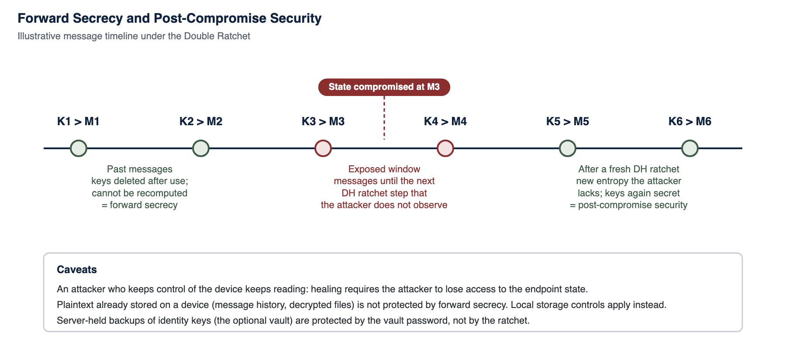

<!-- SANKET Technical Security & Architecture Whitepaper, public edition, version 2.0. Generated from docs/whitepaper; do not edit by hand. -->

# 12. Forward Secrecy and Post-Compromise Security

Forward secrecy and post-compromise security are different properties that are often conflated. One protects the past against a future compromise; the other restores protection for the future after a compromise has ended.

## 12.1 Definitions

- **Forward secrecy (FS):** If an attacker obtains a party's current key state at time T, messages sent before T remain confidential. The Double Ratchet achieves this because chain keys are advanced through a one-way function and message keys are deleted after use, so earlier keys cannot be recomputed.
- **Post-compromise security (PCS), or break-in recovery:** If an attacker obtains key state at T but then loses access, messages sent after the next Diffie-Hellman ratchet step that the attacker did not observe are confidential again. The Double Ratchet achieves this by mixing fresh ephemeral X25519 agreements into the root key.[^35]

Both properties have been established for the Signal Protocol in peer-reviewed formal analysis.[^36] SANKET inherits them by using libsignal unmodified; it does not claim to have independently re-proved them.

*Figure 5: Forward secrecy and post-compromise security on a message timeline*

## 12.2 Worked Timeline

*Table 21: Effect of a key compromise at message M3*

| Message | Key | Status after compromise of session state at M3 | Why |
| --- | --- | --- | --- |
| **M1** | K1 | Protected | K1 was deleted after use and cannot be derived from later chain keys |
| **M2** | K2 | Protected | Same as M1 |
| **M3** | K3 | Exposed | The attacker holds the state that derives K3 |
| **M4** | K4 | Exposed if sent before the next DH ratchet | Symmetric ratchet steps are computable from the compromised chain key |
| **M5** | K5 | Protected after a DH ratchet the attacker did not observe | A new ephemeral X25519 agreement contributes entropy the attacker lacks |
| **M6** | K6 | Protected | Recovery persists while the attacker remains out of the endpoint |

## 12.3 Behaviour in SANKET Specifically

- **Per device pair.** Because group messages are pairwise fan-out, every recipient device has its own ratchet. A compromise of one session does not expose other members' sessions.
- **Reactions and encrypted broadcasts.** Both travel as libsignal messages with the same per-device Double Ratchet properties. An encrypted broadcast is encrypted by the broadcast-sender desktop for every recipient device through its own session, with no sender keys, so it has the same forward secrecy and post-compromise security as a one-to-one message; its server-side copy for a device is deleted as soon as that device confirms it has stored the broadcast, and otherwise at expiry.
- **Server-side ciphertext lifetime.** Delivered ciphertext is removed from the server after a short window, so a later server compromise cannot collect long history to combine with a later key compromise.
- **Session repair.** When a session is reset after repeated decryption failure, a fresh PQXDH handshake starts a new ratchet; this also refreshes the post-quantum contribution.
- **Calls.** Every call, one-to-one included, has its own server-issued call id that names its media room and binds its frame keys, so nothing from an earlier call can enter a later one. Call sender keys ratchet forward every 200 ms with HKDF and are replaced with fresh random keys whenever a participant joins or leaves, giving forward secrecy at the granularity of a key epoch and preventing joiners from decrypting earlier media or leavers from decrypting later media.
- **Post-quantum dimension.** PQXDH protects the initial handshake against harvest-now-decrypt-later, and the SPQR ratchet in the libsignal release in use extends forward secrecy and post-compromise security with a post-quantum component (Chapter 39).

## 12.4 Scope of the Properties

> [!NOTE]
> **Note - What forward secrecy does not do**
>
> - It does not protect plaintext already stored on a device. Message history in the local encrypted database is protected by local storage controls and the device's lock, not by the ratchet.
>
> - It does not heal an attacker who keeps control of the endpoint. Post-compromise security requires the attacker to lose access to the key state.
>
> - It does not protect a user's identity key held in the optional vault backup. That copy is protected by the vault password.
>
> - It does not apply to routing metadata or to notice broadcasts (the announcement type that is labelled as not end-to-end encrypted), which are handled by the server as described in Chapter 20. Replies, reactions, classification labels, encrypted broadcasts, link previews, locations, contact cards and forwarded-message references travel inside the ciphertext and are covered.

---

[^35]: T. Perrin, M. Marlinspike, "The Double Ratchet Algorithm", Signal specification. signal.org/docs/specifications/doubleratchet/
[^36]: K. Cohn-Gordon, C. Cremers, B. Dowling, L. Garratt, D. Stebila, "A Formal Security Analysis of the Signal Messaging Protocol", IEEE EuroS&P 2017; extended version in Journal of Cryptology 33, 2020.

---

[Previous: 11. Key Management Architecture](11-key-management-architecture.md) | [Contents](../README.md) | [Next: 13. Identity and Authentication](13-identity-and-authentication.md)
