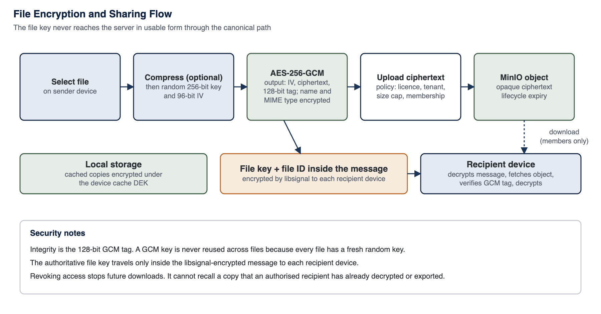

<!-- SANKET Technical Security & Architecture Whitepaper, public edition, version 2.0. Generated from docs/whitepaper; do not edit by hand. -->

# 18. File Security Lifecycle

Files are encrypted before they leave the device, stored as opaque objects, and decrypted only on recipient devices.

*Figure 10: File encryption and sharing flow*

*Table 34: File lifecycle*

| Stage | What happens | Control |
| --- | --- | --- |
| **Selection** | User chooses a file, photo, video, voice note, location or contact | Per-source enablement and type allow/block lists |
| **Local encryption** | Optional compression, then AES-256-GCM with a fresh random 256-bit key and 96-bit IV; name and type encrypted | Strict 256-bit key helper; per-file key |
| **Policy check** | Upload request carries metadata only; server checks licence, tenant policy, size and duration caps and active membership | Server |
| **Upload** | Ciphertext sent through the API to object storage; Content-Length checked before buffering | TLS; size limits |
| **Key delivery** | File key and identifier sent inside the message body, encrypted by libsignal to each recipient device on its signed device list | End-to-end |
| **Classification label** | Optional label per attachment, carried with the file key inside the end-to-end encrypted envelope; the upload request carries no label, so the server never learns it (Chapter 38) | End-to-end; client policy |
| **Access** | Download allowed only to active members of the conversation; always served as opaque binary | Server membership check |
| **Preview** | Rendered on the device from decrypted data; no server-side thumbnails | Client |
| **Download to device** | Saving outside the app is off by default; desktop has a separate export permission. A file whose effective label ranks above the lowest configured label cannot be forwarded, exported or saved to the device on mobile or desktop, the desktop secure viewer included, whatever the general policy says | Policy and label (mobile and desktop) |
| **Watermarking** | Desktop and mobile file viewers can overlay a visible Sanket ID or name watermark (configurable) | Desktop and mobile |
| **Local caching** | Cached copies stored encrypted under the device cache DEK | SQLCipher / AES-256-GCM |
| **Expiry** | Object-storage lifecycle expires attachment objects after 90 days; disappearing-message expiry also removes cached copies on devices | Server lifecycle; client purge |
| **Audit** | Upload, download, preview and export events recorded | Audit chain |
| **Deletion** | Objects removed by lifecycle or account purge | Server |

## 18.1 Broadcast Attachments

An attachment to an encrypted broadcast is encrypted once, on the broadcast-sender desktop, with its own random AES-256-GCM key, and uploaded once, however many devices receive it. The file key travels inside each recipient device's libsignal-encrypted copy of the broadcast, so the server stores a single opaque object and never the key (Chapter 17). An attachment to a notice-type broadcast, which the server can read, is not end-to-end encrypted and is labelled accordingly (Chapter 27).

## 18.2 Viewing Files on Mobile

Where the operating system viewer requires a file on disk, a short-lived decrypted copy is placed in the application's private sandbox, protected by the device's storage encryption, and is removed as soon as it is no longer in use, with a start-up sweep and every erase path removing any that remain. Inline images and media in a conversation are shown again from the encrypted attachment store when the app returns to the foreground. Customers with strict handling requirements combine the download-to-device restriction with managed devices.

Documents open inside the application, so the sharing restriction never leaves a user unable to read a file they received: text formats are shown as plain text and never rendered (received HTML and images in SVG form cannot run or load anything), PDF and office documents are shown by platform renderers with scripts and navigation disabled, under the same deletion rules.

## 18.3 Revocation

> [!NOTE]
> **Note - Revocation and plaintext already obtained**
>
> Removing a member, revoking a device, or deleting an object prevents future downloads and future decryption on revoked devices. It cannot recall a file that an authorised recipient has already downloaded, decrypted, exported, printed or photographed. File access follows conversation membership, so removing a member is the revocation action.

---

[Previous: 17. Message Security Lifecycle](17-message-security-lifecycle.md) | [Contents](../README.md) | [Next: 19. Secure Voice and Video](19-secure-voice-and-video.md)
