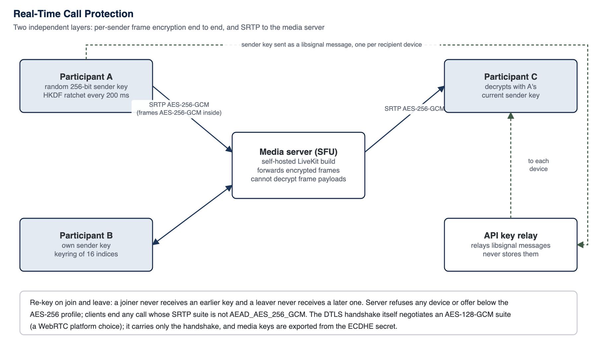

<!-- SANKET Technical Security & Architecture Whitepaper, public edition, version 2.0. Generated from docs/whitepaper; do not edit by hand. -->

# 19. Secure Voice and Video

*Part of the [SANKET Technical Security & Architecture Whitepaper](../README.md) by [Tosh Defence](../ABOUT.md#about-tosh-defence), public edition 2.0.*

SANKET calls run through a self-hosted selective forwarding unit (SFU), with two independent layers of protection: end-to-end frame encryption between participants, and SRTP between each participant and the SFU.

*Figure 11: Real-time call protection*

## 19.1 Media Server

The SFU is Tosh Defence's build of the open-source LiveKit server,[^51] pinned to a fixed upstream release at a fixed source commit (the build fails if the upstream tag moves) and distributed to customers as a release image. Every call, one-to-one included, has its own server-issued call identifier that names its media room and binds its frame keys, so nothing from an earlier call can enter a later one. Room tokens are issued only to active members of the conversation, and the server signs each participant's device identity into the token so a client cannot claim another device. Media uses a single multiplexed UDP port, the primary and lowest-latency path, with a TCP fallback; where a network allows only outbound TCP 443, media is relayed by TURN over TLS on port 443 (Calls in Isolated and Restrictive Networks, below). In the high-availability profile the media server runs as several nodes coordinated through the installation's state store, each with its own media address and the same AES-256 SRTP policy (Chapter 32).

## 19.2 Frame Encryption (End to End)

*Table 35: Call frame encryption parameters*

| Parameter | Value |
| --- | --- |
| **Frame cipher** | AES-256-GCM via WebRTC insertable streams (frame cryptor) |
| **Keying** | One random 256-bit sender key per participant device (not a shared room key) |
| **Ratchet** | Every 200 ms the sender advances its key: next = HKDF-SHA256(key, fixed salt, 32 bytes); receivers follow the same ratchet within a window of 16 steps |
| **Key ring** | 16 key indices per sender |
| **Membership change** | On every join or leave, each sender generates a new random key at the next index and sends it only to the current participants; senders switch when all acknowledge or after 750 ms. A joiner never receives an earlier key and a leaver never receives a later one |
| **Key transport** | Each sender key is the plaintext of a libsignal message to each recipient device, relayed by the API without storage, bound to the call identifier, and accepted only between members of a live call with trusted devices; it is sent only to devices on the participants' signed device lists (Chapter 13); a monotonic generation counter rejects replayed or older keys |
| **Mobile implementation** | Patched WebRTC SDK with 256-bit frame keys at all key-derivation sites; the build refuses artefacts whose SHA-256 does not match the pinned manifest |
| **Desktop implementation** | livekit-client key provider configured for 256-bit HKDF per-sender keys |
| **Fail closed** | Clients refuse to publish media without end-to-end encryption and their own key |

The SFU forwards encrypted frames and cannot decrypt their payloads. This design is comparable in intent to the IETF SFrame approach[^52] but uses LiveKit's frame-cryptor format rather than RFC 9605 wire encoding.

## 19.3 Key Rotation Rate

Because every participant ratchets its sender key every 200 milliseconds, a call derives **five new frame-encryption keys per second for each sender**, continuously, for the whole call, whatever its length. On top of that schedule, every join or leave triggers a fresh random key. A key captured from memory at one moment therefore decrypts at most the media sent in that 200 ms epoch and those that follow until the next change of membership; earlier epochs cannot be recovered from it, because each step is a one-way HKDF derivation. Messages are keyed even more finely: the Double Ratchet derives a new key for every single message (Chapter 12).

*Table 36: Key renewal in calls and messages*

| Channel | Key renewal | Rate |
| --- | --- | --- |
| **Call media (each sender)** | HKDF ratchet of the sender key | 5 keys per second (every 200 ms) |
| **Call media (membership change)** | New random 256-bit sender key distributed over libsignal | On every join and leave |
| **Messages** | Double Ratchet symmetric step, plus a Diffie-Hellman and SPQR step on each change of direction | A new key for every message |
| **Session establishment** | PQXDH with a one-time prekey where available | Per new session |

## 19.4 Transport Encryption (Client to SFU)

WebRTC media is protected with SRTP keyed by DTLS.[^53][^54] SANKET's LiveKit build sets AEAD_AES_256_GCM as the only acceptable SRTP protection profile;[^55] the build includes proof tests with real handshakes in both DTLS roles and fails if a client without AES-256-GCM is accepted. Clients independently inspect the negotiated suite on both transports shortly after connecting and periodically thereafter, and end the call if it is anything other than AEAD_AES_256_GCM.

> [!NOTE]
> **Note - DTLS handshake suite**
>
> No voice, video or message data is ever protected by the DTLS cipher. WebRTC uses DTLS only as a key-agreement handshake, negotiated with an ECDHE-ECDSA suite (AES-128-GCM in the upstream WebRTC library, which does not offer AES-256 DTLS suites). The SRTP master keys are exported from the ECDHE secret rather than encrypted under that suite, and the DTLS records carry only the handshake and an unused data channel. Media confidentiality therefore rests entirely on AES-256: AES-256-GCM frame encryption inside AES-256-GCM SRTP. Mobile and desktop compute the same verdict on the negotiated handshake suite by one shared rule and record it in every call's log, so an assessor can confirm it on any installation; the verdict is evidence and never ends a call.

## 19.5 Operation on 3G, 4G and Constrained Networks

SANKET calls are engineered for narrow and variable bandwidth such as 3G and congested 4G links. One shared network-profile module decides every encoding parameter, so that iOS, Android and desktop behave identically.

*Table 37: Codecs and adaptation for constrained networks*

| Element | Behaviour |
| --- | --- |
| **Audio codec** | Opus in every call, with discontinuous transmission (DTX) so that silence costs almost no bandwidth, and Opus in-band forward error correction to conceal packet loss |
| **Audio bit rate** | 24 kbps (speech quality) on a normal link; 12 kbps (telephone quality) when the link is constrained |
| **Video codec** | VP8 with simulcast: the sender publishes up to three quality layers, and the media server forwards a lower layer to a receiver on a weak link without the sender re-encoding |
| **Automatic adaptation** | A network-adaptation state machine watches link quality; on a poor link it lowers the audio bit rate and pauses outgoing video, so that voice remains intelligible, and restores both when the link recovers |
| **Transport** | Media over a single multiplexed UDP port, with a TCP fallback and, where only TCP 443 is open, TURN over TLS on port 443; signalling over the authenticated WebSocket, which reconnects with jittered back-off after a drop |
| **Networks** | 3G, 4G, 4.5G and 5G mobile networks, Wi-Fi and wired networks |

## 19.6 Server Enforcement

- The server refuses a room token to any device below the AES-256 call profile, refuses any offer that does not declare it, and refuses to ring anyone without a capable device; a refused call is never relayed or rung.
- A device on a call is marked busy and is not rung again; its other free devices still ring.
- Call signalling travels over the authenticated WebSocket. The call offer carries the caller's display name and call type, which the server can read.
- Call wake-up pushes carry only routing identifiers and a generic title; the caller's name is filled in on the device from its local cache. The room token is fetched afterwards over the authenticated API.

## 19.7 Calls in Isolated and Restrictive Networks

Many hotel, ministry and mobile networks allow only outbound TCP on port 443. On an internet-facing installation one public TCP 443 port carries both HTTPS and TURN, separated at the edge without decrypting. TURN over TLS is terminated by the edge with TLS 1.3 and TLS_AES_256_GCM_SHA384 only (AES-128 and ChaCha20 are refused), so the media server no longer holds that certificate key, and the relay is restricted by SANKET's build of the media server to the node's own media address, so it cannot be used as an open relay. Inside that TLS tunnel the media keeps its AES-256-GCM frame encryption and AES-256-GCM SRTP. TURN is used on internet-facing installations and not on air-gapped ones, where no outside client exists; UDP media remains the primary path. Calls have been demonstrated over TCP 443 alone on iOS, Android and desktop.

Server upgrades are designed to preserve calls in progress: services are recreated only when their image or configuration changes, and where a release allows it the new application server takes over from the old one without interrupting call media; other releases are applied in a planned maintenance window.

Every installation sets the media server's address explicitly: the public address of an internet-facing server, or the enclave address of an air-gapped one. The media server advertises that address to calling devices and never contacts a public STUN server to discover it, and SANKET's build of the media server no longer hands calling devices the public STUN servers the upstream release supplies by default, so neither side of a call reaches a foreign STUN service; the installer, the upgrade tool and the install-time security gates refuse a non-local installation without it, and refuse a configuration that would turn STUN discovery back on (Chapter 43).

## 19.8 No Recording

SANKET has no server-side call recording capability and no lawful-intercept interface, and its design excludes them: the server never holds frame keys.

---

### About SANKET

SANKET (संकेत) by [Tosh Defence](../ABOUT.md#about-tosh-defence) is a sovereign secure communications platform for defence, government and other high-trust organisations: end-to-end encrypted messaging, file exchange, voice and video calls and priority broadcast, built on Signal's official libsignal library and AES-256, self-hosted on infrastructure the organisation owns, including air-gapped networks. [About SANKET and Tosh Defence](../ABOUT.md) | [Website](https://www.sanket.chat) | [Full whitepaper](../README.md)

---

[^51]: LiveKit project, "LiveKit open source WebRTC SFU" and "End-to-end encryption" documentation, github.com/livekit/livekit and docs.livekit.io.
[^52]: E. Omara et al., "Secure Frame (SFrame): Lightweight Authenticated Encryption for Real-Time Media", IETF RFC 9605, August 2024.
[^53]: M. Baugher et al., "The Secure Real-time Transport Protocol (SRTP)", IETF RFC 3711, March 2004.
[^54]: D. McGrew, E. Rescorla, "DTLS Extension to Establish Keys for SRTP", IETF RFC 5764, May 2010.
[^55]: D. McGrew, K. Igoe, "AES-GCM Authenticated Encryption in SRTP", IETF RFC 7714, December 2015.

---

[Previous: 18. File Security Lifecycle](18-file-security-lifecycle.md) | [Contents](../README.md) | [Next: 20. Metadata Security](20-metadata-security.md)
