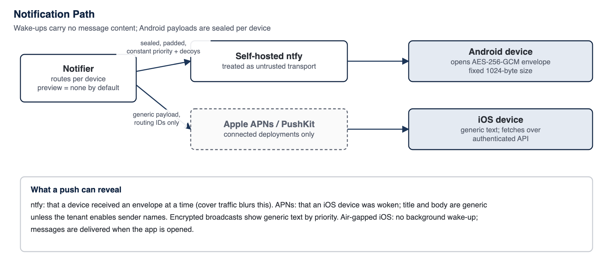

<!-- SANKET Technical Security & Architecture Whitepaper, public edition, version 2.0. Generated from docs/whitepaper; do not edit by hand. -->

# 20. Metadata Security

End-to-end encryption hides what is said. It does not, by itself, hide who said it, to whom, when, how much or from where. For many high-trust organisations that metadata is as sensitive as content, so this chapter sets out exactly what SANKET's server handles.

## 20.1 Metadata Inventory

*Table 38: Metadata handled by the server in the described release*

| Metadata | Visible to server? | Why it is needed | Minimisation and retention |
| --- | --- | --- | --- |
| **Sender account and device of each message** | Yes | Authorisation, routing, receipts, audit | Required for accountability in an organisational platform; sealed sender is not provided |
| **Recipient devices of each message** | Yes | Fan-out delivery | Per-device rows tombstoned 72 h after delivery |
| **Conversation membership and group names** | Yes | Access control | Group names and descriptions are stored in clear |
| **Timestamps and delivery / read state** | Yes | Ordering and receipts | Read receipts and typing can be disabled by policy and user |
| **Ciphertext size** | Yes, as a size band | Inherent to any transport | Padded to 160-byte blocks; disappearing messages and short server-side retention limit its value |
| **Message adjuncts (reply excerpts, link previews, locations, contact cards, forwarded-from)** | No (inside ciphertext) | Carried in the end-to-end encrypted content envelope | Not stored by the server outside the ciphertext; each feature controllable by policy |
| **Reactions** | No (inside ciphertext) | Sent as end-to-end encrypted messages; each device computes the counts | Opaque per-device rows tombstoned like messages; optional emoji-free count for large groups, off by default (the server then learns who reacted to which message, never the emoji); disable by policy |
| **Classification labels** | No (inside ciphertext) | Carried in the end-to-end encrypted envelope for each message and attachment | The label list itself is tenant configuration, never sent to unauthenticated callers; devices report coarse label events to the audit log without message or conversation identity (Chapter 38) |
| **Encrypted broadcasts: priority, audience, deadline, expiry, receipts** | Yes (title, body and attachments: No, inside ciphertext) | Fan-out to every recipient device, acknowledgement, deadline and escalation | Per-device ciphertext deleted once each device confirms storage, otherwise at expiry; push and alerts carry identifiers, priority and deadlines only (Chapter 17) |
| **Notice broadcasts: title, body, attachments** | Yes | Non-sensitive announcements from the administrator console, labelled as not end-to-end encrypted | Retention 90 days by default |
| **Call metadata (participants, type, start, duration, caller display name in offer)** | Yes | Signalling, one-call-per-device, call logs | Call logs retained 365 days by default and rolled up |
| **Device information (platform, model, app version, hardware protection level, client certificate fingerprint)** | Yes | Compatibility, update enforcement and device governance; binding the device certificate to the device record | Shown to administrators; device certificates carry an opaque random name, no user or device identifier |
| **IP addresses and user agents** | Yes | Abuse prevention and audit | In audit records; masked identifiers in edge logs |
| **Sign-in and security events** | Yes | Security and accountability | Audit log retained per policy (Chapter 21) |
| **Account profile (Sanket ID, display name, email, phone)** | Yes | Directory and verification | Phone and email optional; stored in clear |
| **Identity-provider mapping (when federated sign-in is configured)** | Yes | Linking the customer's own identity provider or directory to administrators and to Sanket IDs | No account is created from the provider; provider secrets held in the key service (Chapter 13) |
| **Signed device lists** | Yes | Letting senders verify every recipient device before encrypting | Append-only log of each account's signed lists; reveals the same devices and device kinds as the device inventory |
| **Usage analytics** | Yes, pseudonymous (when on) | First-party usage statistics | On by default; the organisation can switch it off and an installation-level lock can force it off, after which nothing is collected; counts only, no content, no third party; rollup retention configurable (Chapter 22) |
| **Push wake-ups** | Partially (to relay) | Waking devices | Content-free: sealed or generic payloads carrying only routing identifiers, with fixed size and decoy traffic where the platform allows. Wake-ups for encrypted broadcasts carry no content, only a generic text by priority |

## 20.2 What SANKET Does to Minimise Metadata

- **Self-hosting** keeps all metadata within the customer's boundary; nothing is sent to Tosh Defence except, if enabled, a signed status report containing counts of users, administrators and groups and the release version.
- **Content-free notifications** by default: no sender name and no preview.
- **Reactions, encrypted broadcasts and classification labels inside the ciphertext**, so the server holds none of their content.
- **Sealed wake-ups** that hide which events occurred, padded to a fixed size and mixed with decoy traffic where the platform allows.
- **Non-enumerable directory:** users can find others only by exact Sanket ID or among people they already share a group with.
- **Short server-side ciphertext lifetime** and configurable retention windows.
- **Edge logs mask identifiers** that appear in request paths.
- **Last-seen visibility** can be restricted to contacts or nobody.

*Figure 12: Notification path*

## 20.3 Content Confidentiality Versus Traffic-Analysis Resistance

SANKET provides strong content confidentiality. It does not provide traffic-analysis resistance against the operator of the installation, nor against a network observer who can see device-to-installation traffic volumes and timing. Systems that resist traffic analysis use techniques such as sealed sender, constant-rate cover traffic, mixing or onion routing,[^56] which carry significant cost. SANKET does not provide sealed sender: the server sees the sending account and device of every message. For most customers the decisive mitigation is that the operator is the customer itself; where insider metadata analysis is a concern, access to the database and audit records should be separated and monitored (Chapter 27).

---

[^56]: Signal, "Technology preview: Sealed sender for Signal", signal.org/blog/sealed-sender/, October 2018.

---

[Previous: 19. Secure Voice and Video](19-secure-voice-and-video.md) | [Contents](../README.md) | [Next: 21. Audit Architecture](21-audit-architecture.md)
