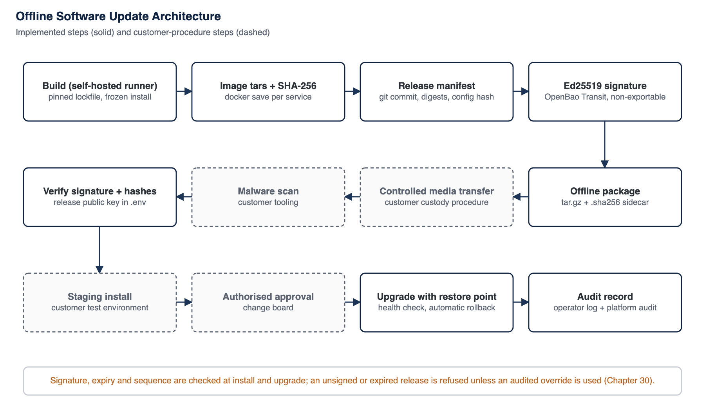

<!-- SANKET Technical Security & Architecture Whitepaper, public edition, version 2.0. Generated from docs/whitepaper; do not edit by hand. -->

# 30. Software Supply Chain and Secure Updates

*Part of the [SANKET Technical Security & Architecture Whitepaper](../README.md) by [Tosh Defence](../ABOUT.md#about-tosh-defence), public edition 2.0.*

A communications platform is only as trustworthy as the process that produces and delivers its software. SANKET gives the customer the means to verify a release independently and to decide when it is installed.

## 30.1 Supply-Chain Controls

*Table 52: Software supply-chain controls*

| Control | Current state | Status |
| --- | --- | --- |
| **Dependency inventory and pinning** | Single workspace lockfile; frozen installs in every container build; exact-version saving for new dependencies | **IMPLEMENTED** |
| **Upstream source pinning** | The media server is built from a pinned upstream tag verified against a fixed commit; patched WebRTC artefacts are pinned by SHA-256; every base and third-party container image is pinned by version and content digest, enforced by a release check | **IMPLEMENTED** |
| **Cryptographic policy checks** | Pre-commit checks reject non-AES-256 constructions, WebRTC dependency changes without a rebuilt patched artefact, console logging and native-project drift | **IMPLEMENTED** |
| **Release manifest** | Records git commit, creation time, a monotonic sequence number and an expiry date, every image archive with its SHA-256 and size, every SBOM with its SHA-256, every database migration with its class, the configuration bundle hash and, optionally, the minimum client app version per platform | **IMPLEMENTED** |
| **Release signing** | Canonical manifest signed with Ed25519 by a non-exportable key in OpenBao, on a self-hosted build runner. Hybrid Ed25519 and ML-DSA signatures are held back until an ML-DSA implementation has a published independent audit or an issued CMVP certificate (Chapter 39) | **IMPLEMENTED** |
| **Freshness and rollback protection** | Install and upgrade refuse an expired manifest and any manifest whose sequence number is below the floor the installation has recorded; two releases claiming the same sequence with different content are always refused. A running installation never stops because its manifest expires. Connected upgrades also require a short-lived signed timestamp statement from the release registry, under a key separate from the release key, and refuse one that is missing, expired, names a different manifest or is older than the newest already seen, so an installation cannot be silently held on an old release. This is signed expiry, sequence and timestamp protection, not the full TUF framework | **IMPLEMENTED** |
| **Artefact inventory and SBOM** | Release package includes an inventory of services, images, hashes and source commit, and a package-level CycloneDX SBOM for every image, generated offline by a pinned tool at release time, listed with its SHA-256 in the signed manifest, shipped in the offline package and verified when it is installed or upgraded; the release registry also keeps each SBOM with the release, accepted at publication only when it matches the signed manifest, and delivers it to connected installations, which verify it against the signed manifest in the same way[^62] | **IMPLEMENTED** |
| **Image integrity** | Every image archive is bound by SHA-256 into the Ed25519-signed manifest, so one signature covers the whole release | **BY DESIGN** |
| **Vulnerability scanning** | Every release image is scanned with a pinned scanner and an offline vulnerability database before it is signed or published; a blocking finding stops the release. A container benchmark workflow is also available | **IMPLEMENTED** |
| **Static analysis and secret scanning** | Strict TypeScript, linting and policy checks; repository secret scanning on every change and over the full history weekly, and static analysis with project rules, both run offline on the project's own build runner from digest-pinned tools (a developer pre-commit check is also available) | **IMPLEMENTED** |
| **Android release hardening** | Android release builds are minified and obfuscated, ship no test libraries and expose only required components | **IMPLEMENTED** |
| **Desktop code signing** | macOS hardened runtime and notarisation; Windows Authenticode with update signatures pinned to the publisher | **IMPLEMENTED** |
| **Third-party analytics in builds** | None in any product application; dependency lockfile contains no analytics or crash-reporting SDK | **IMPLEMENTED** |
| **External review of the release chain** | Planned independent review | **CERTIFICATION TARGET** |

The approach aligns with the practices of the NIST Secure Software Development Framework and the SLSA provenance model in intent;[^63][^64] SANKET does not claim a formal SLSA level.

## 30.2 Release Contents

An offline release package is a single archive with a SHA-256 sidecar, containing the signed manifest, image archives for SANKET's own services, the base and release Compose definitions, the hardening overlay, SQL migrations, edge, secrets-service and media-server configuration, deployment scripts and the artefact inventory. It excludes environment files, certificates, keys, secrets and licences. Third-party base images (database, cache, object store, edge, secrets service, push relay) are not bundled and must be pre-staged by the customer from a verified source.

## 30.3 Reference Update Process

*Figure 16: Offline software update architecture*

1. **Build.** Images are built from the pinned lockfile on a self-hosted runner and saved as archives.
2. **Manifest and signature.** The manifest of hashes is signed with the release key.
3. **Package.** The offline package and its checksum are published to the customer through an agreed channel.
4. **Transfer.** The customer moves the package across the air gap on controlled media under its custody procedure.
5. **Scan.** The customer scans the package with its own tools.
6. **Verify.** The verification tool recomputes the manifest digest, every image archive hash and size, and the configuration bundle hash, and verifies the Ed25519 signature with the release public key configured in the installation. It refuses a manifest that has expired or whose sequence number is below the installation's recorded floor. The compose file that names the images to run is never taken from the package: the verification tool writes it from the verified manifest. Each archive is checked at the exact path it is then loaded from, only the archives the manifest lists are loaded, and a connected upgrade refuses an artifact list that differs from the signed manifest. The manifest may also state, per platform (iOS, Android and desktop), the lowest client app version the release needs; that statement is covered by the same signature, its shape is checked, and it is reported only from a manifest whose signature was verified.
7. **Stage.** The customer installs the release in a staging environment and tests it.
8. **Approve.** The customer's change authority approves deployment.
9. **Upgrade.** The upgrade tool verifies again, loads images, snapshots the current state, switches versions, runs a health check and rolls back automatically on failure. Images are verified and loaded, and every image the new version needs is checked to be present, before any service is interrupted: a release that cannot be staged fails with the running version still serving. The manifest also lists every database migration with its class (expand: the previous version keeps working; contract: it may not) under the same signature. In the high-availability profile the upgrade runs host by host with health gates between steps, and every host performs the same signature, expiry, sequence and downgrade checks itself: a host given an unsigned or older package refuses it even when the others accept.
10. **Record.** The upgrade is recorded; post-upgrade gates check that running images match the manifest.

> [!TIP]
> **Recommended Practice - Configure the release public key**
>
> Signature verification uses the release public key configured in the installation environment, obtained from Tosh Defence through an independent channel. Installation and upgrade refuse a release whose signature cannot be verified, whether the key is missing or the signature does not match, and so do the connected upgrade from the administrator console and the server's own start-up check.

## 30.4 Independent Verification by an Air-Gapped Customer

The verification tool uses only built-in platform cryptography and can be run on an isolated machine. A customer can therefore: obtain the release public key once, out of band; recompute every hash in the package; verify the signature; compare the manifest's source commit with any source-escrow arrangement; and confirm after installation that running images match the manifest.

## 30.5 Rollback, Pinning and Emergency Patches

- **Version pinning:** every base and third-party image is pinned by version and content digest in the container builds and the deployed configuration, and a release check refuses a reference pinned by tag alone. SANKET's own images are pinned by the SHA-256 of their signed release archives, and post-install gates check the running images against the signed manifest.
- **Rollback:** automatic. An upgrade is complete only after the new version is healthy, has applied its database migrations and answers smoke checks; on any failure it restores the previous images, configuration and, where the switch requires it, databases from its encrypted restore point, then checks the previous version the same way. Restore points are integrity-checked and bound to their installation before use. Every upgrade and rollback is recorded in the release audit log.
- **Release selection:** which signed releases may be installed is governed by the customer's change management. An expired release is refused, so an old release cannot be presented as current indefinitely, and downgrades are refused by the signed sequence number as well as the release version unless explicitly authorised and recorded in the release audit log. A server also refuses a signed licence that requires a newer backend release. An organisation can therefore still roll back deliberately to an earlier signed release when operationally required.
- **Emergency patches** follow the same signed path; a configuration-only release can update the configuration bundle without new images.
- **Connected upgrades** (optional) fetch packages and their SBOMs with short-lived, signed download authorisations, check the registry's signed timestamp statement, verify the package and run the same process. Upgrade execution from the console is off by default.

---

### About SANKET

SANKET (संकेत) by [Tosh Defence](../ABOUT.md#about-tosh-defence) is a sovereign secure communications platform for defence, government and other high-trust organisations: end-to-end encrypted messaging, file exchange, voice and video calls and priority broadcast, built on Signal's official libsignal library and AES-256, self-hosted on infrastructure the organisation owns, including air-gapped networks. [About SANKET and Tosh Defence](../ABOUT.md) | [Website](https://www.sanket.chat) | [Full whitepaper](../README.md)

---

[^62]: OWASP Foundation, "CycloneDX Bill of Materials Standard" (ECMA-424); and The Linux Foundation, "SPDX Specification" (ISO/IEC 5962:2021).
[^63]: M. Souppaya, K. Scarfone, D. Dodson, "Secure Software Development Framework (SSDF) Version 1.1", NIST SP 800-218, February 2022.
[^64]: OpenSSF, "Supply-chain Levels for Software Artifacts (SLSA)" v1.0, slsa.dev.

---

[Previous: 29. Endpoint Compromise Analysis](29-endpoint-compromise-analysis.md) | [Contents](../README.md) | [Next: 31. Offline Licensing](31-offline-licensing.md)
